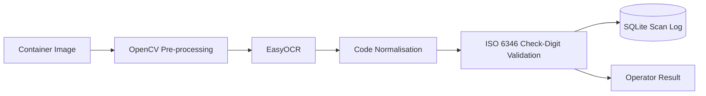

# AI-Based Container Scanner — Architecture

## System flow

## Design intent

The project uses a deterministic standards-validation layer after OCR. OCR proposes the text that appears in the image; ISO 6346 validation independently checks whether the resulting container identification code is structurally consistent with the standard.

This is important because OCR confidence alone should not be interpreted as proof that a container identifier is valid.

## Engineering boundaries

- Computer vision handles image preparation and character extraction.
- Code normalisation converts OCR output into a predictable representation.
- Standards logic performs check-digit validation independently of the OCR model.
- Persistence records results for later analysis and integration.
- Raspberry Pi is the intended edge-compute target, reducing dependence on continuous cloud connectivity.

## Production evolution

A production implementation should introduce an API boundary, authenticated users, encrypted/managed persistence, reproducible benchmark datasets, calibrated rejection thresholds, monitoring and integration with authorised operational systems.
